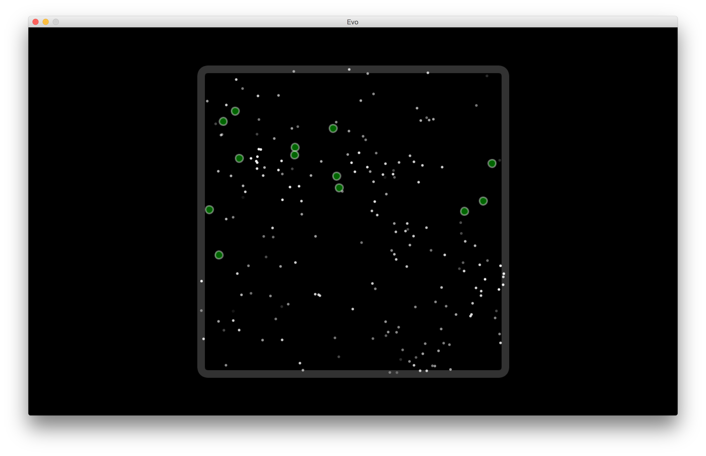

# Evo
Environment for testing natural selection processes on some digital "bugs"

## Key Parameters:

    W, width of canvas [pixels]
    H, height of canvas [pixels]

    D_f, diameter of food [pixels]
    P_f, period of food generation [ticks]

    D_b, diameter of bug [pixels]
    V_b, maximum velocity of a "bug" [pixels/tick]
    S_b, number of bugs "spawned" when food eaten [bugs]
    H_b, number of ticks a bug can go without food before death [ticks]

## Key Behaviors

    - Bug acceleration is "random" in 2D space but velocity never exceeds V_b
    - The canvas is "infinite" (i.e. if bug wanders off left side it will appear on right side, and vice versa)
    - Upon encountering food, a bug will eat it.  The polygon representing the bug and the food must intersect.
    - If a bug goes length of time H_b without eating food it will disappear from simulation
    - Upon eating food, the bug will become completely "full" and will instantly generate offspring of amount S_b
    - Every amount of time P_f, a unit of food is placed randomly on the canvas

## Directions:
1. Download Processing (2.2.1) - https://processing.org/download/
2. Confirm Lastest Java is Installed https://java.com/en/download/mac_download.jsp
3. Clone The Repository
4. Run "Evo.pde" using Processing Application

## Screenshot
 
